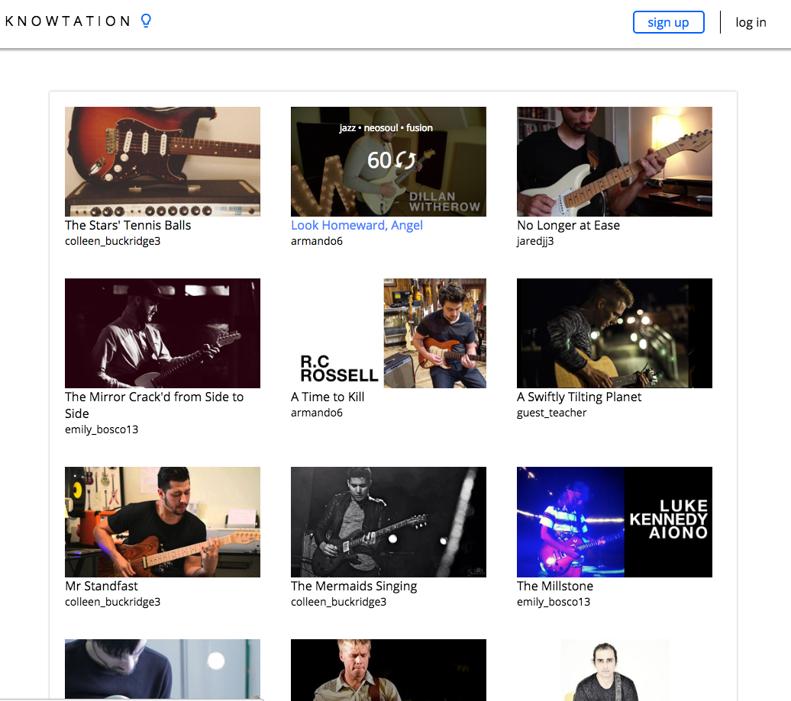
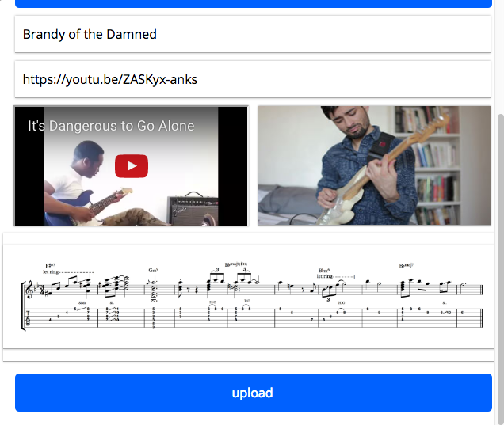
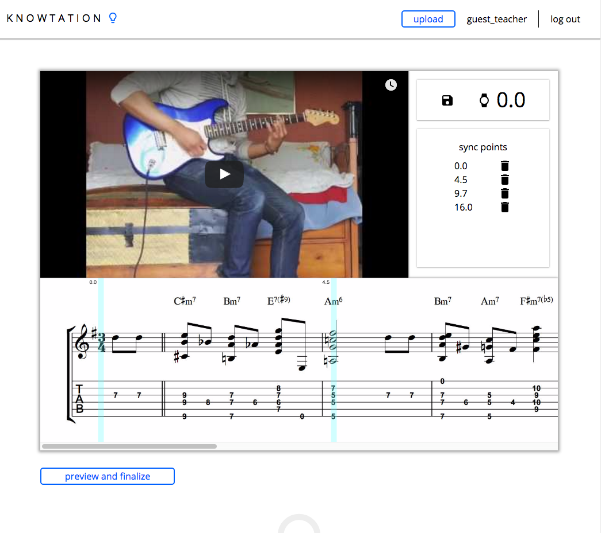
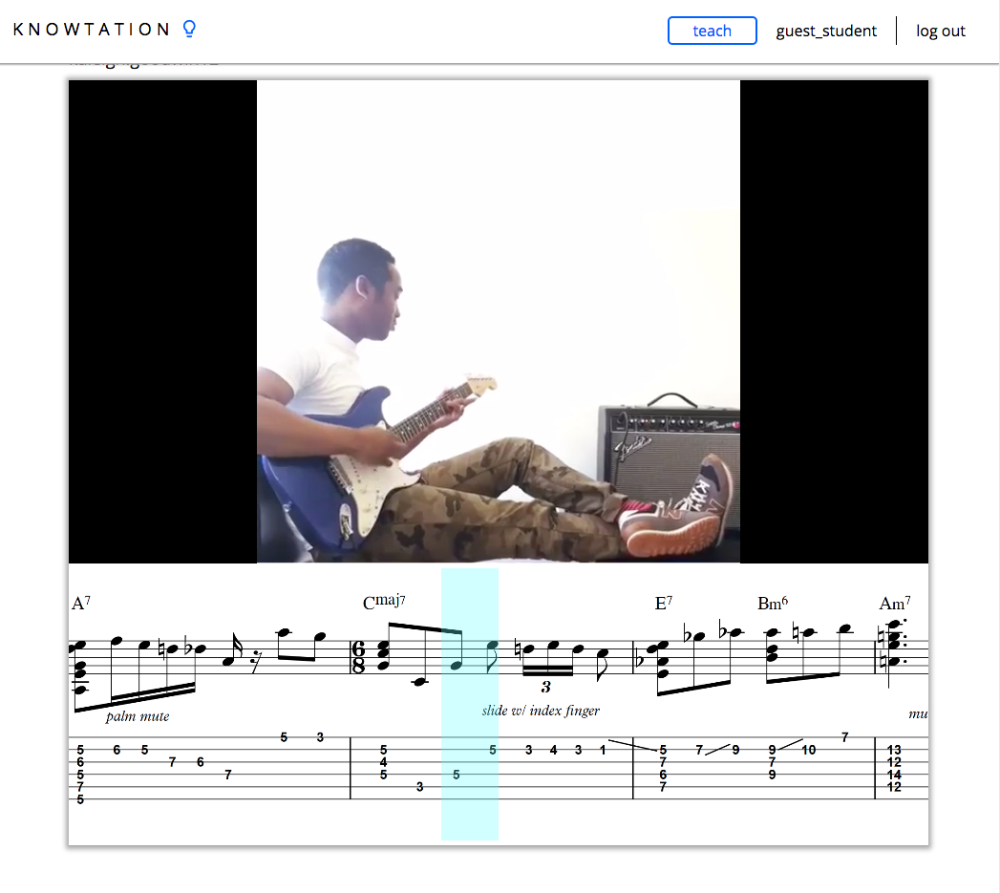
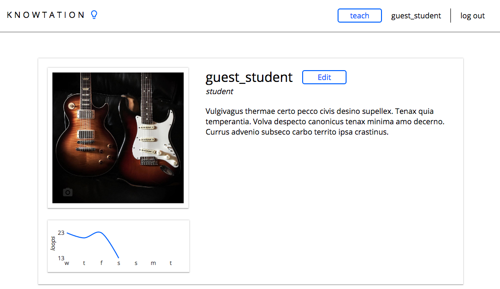

# Knowtation

[Live](http://www.knowtation.net)
<br/>
[Source](http://github.com/jaredjj3/Knowtation)

Knowtation is a full-stack web application inspired by InstantNotation,
a website that allows students to quickly learn guitar using synchronized
music notation and video.

## Features and Implementation

Knowtation is synchronized music notation and video. It is designed to allow
guitar students to have visual and audio assistance in learning music. It
especially benefits guitar teachers, as they don't have to be present for the
student to learn.

### Library

The library displays an index of all of the available Knowtation videos. The
results are cached on the client's side, so necessary requests are avoided.
On the event that a thumbnail is hovered, the tags and number of loops
are displayed. Each Knowtation item also has a link to the author's
profile.



### Upload

The upload form allows teachers to create Knowtations. A completed form will include a link to the Knowtation's corresponding video, a thumbnail, and a 1 line music notation image. Once this form is submitted, the Knowtation Editor is loaded and



### Knowtation Editor

The Knowtation editor allows the user to set an array of sync points. Each sync point
has a time and position that the video should be synced with the music notation.
The user can add a point by clicking on the music notation at a particular position.
From there, they can add the time that the sync point should be at. The user
can remove a point by clicking on the point itself, or by using the garbage can icon
in the sync point list. Knowtation can have as many sync points as the user wishes, but must at least have a sync point at time 0.0s and another at or greater than the video's duration time.



The Knowtation editor uses `requestAnimationFrame` to render the sync
points continuously and updates the `scrollInstructions` on the click event
on the 'preview and finalize button'.

### Knowtation Player

The Knowtation player works by parsing the array of sync points, which is stored in `scrollInstructions`. Each sync point is an object that describes the position and time that the Knowtation player should sync.



The scrolling effect is achieved by translating the source image onto the canvas element that displays the music notation. For each frame:

* the YouTube player is queried for its `currentTime`
* the corresponding music notation position is calculated
* the music notation is rendered according to the calculation

```javascript
calculatePosition(knowtation) {
  const { scrollInstructions } = knowtation;
  const currentTime = knowtation.videoElement.getCurrentTime();

  // for loop that only goes to the second to last element
  for (let i = 0; i < scrollInstructions.length - 1; i++) {
    const syncPoint1 = scrollInstructions[i];
    const syncPoint2 = scrollInstructions[i + 1];
    const currentTimeIsBetween = this.isBetween(currentTime, syncPoint1.time, syncPoint2.time);

    if (currentTimeIsBetween) {
      const offset = knowtation.destination.width / 2;
      const x2 = syncPoint2.pos.x;
      const x1 = syncPoint1.pos.x;
      const t2 = syncPoint2.time;
      const t1 = syncPoint1.time;
      const t = currentTime;
      const vel = (x2 - x1) / (t2 - t1);
      const result = -450 + x1 + ((t - t1) * (x2 - x1) / (t2 - t1));
      return -result;
    }
  }
}

```

Additional measures were made to ensure that Knowtation does not start playing before the video and music notation assets are loaded. While the video and music notation are loading, a loading modal is toggled, which prevents the user from making unwanted click events. After each asset is loaded, the Knowtation player is reinitialized to refresh the references to the video and canvas elements. Finally, when the Knowtation player is ready, the loading modal will be toggled off. It takes about 3 seconds for the Knowtation player to be ready.

### User Profile

User profiles display the type of user they are, a short graph of their progress, and a short biography. Users can update their information by clicking on their profile picture or by clicking the 'Edit' button. The user's progress is the number of loops they have given in the past 7 days.



## Technologies

On the frontend, Knowtation uses the React/Redux framework to be an interactive single page application. On the backend, Knowtation uses Ruby on Rails to interact with a PostgresQL database and serve the results to the frontend.
